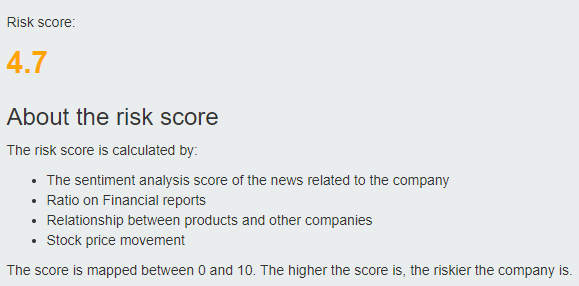

# Risk-Analysis-on-Taiwanese-Companies

In this project, we aim to provide a system that could perform risk analysis to companies based on:

* Accounting Information
* Industrial Prospective
* Company Reputation
* Company Relationships

To be more accurate, we design our system to have the ability to
1. Analyze the financial report and extract important informations
2. Perform social media monitering and analysis on certain companies and industries
3. Build graph database for companies and products and infer relationships on it

## Model Overview
The image below shows the overview of our model. 

Our model can be split into three parts:

### Financial Reports
For the financial reports, we collect the following information as feature.

| Category           | Variable | Ratios                                    |
|--------------------|----------|-------------------------------------------|
| Firm size          | Z1       | Total asset value                         |
|                    | Z4       | Book-to-market value                      |
| Financial leverage | Z5       | long-term debts / total invested capital  |
|                    | Z7       | Total debt / total capital                |
| Profitability      | Z11      | Operating income / received capitals      |
|                    | Z13      | Net income before tax / received capitals |
|                    | Z15      | Gross profit margin                       |
|                    | Z17      | Earnings per share (EPS)                  |
| Liquidity          | Z22      | Quick Ratio                               |

### Sentiment Analysis on News and Social Media Posts
We crawled news from Google News and social media posts from PTT (the largest discussion board in Taiwan).
We collect posts from four categories:
* Company names
* Products
* Industry
* CEO names

For each category, we analyze the sentiment of the posts from Google News and PTT using Bidirectional Encoder Representations from Transformers (BERT). 

### Relationship
In this part, we used Ardi to build the graph database. We obtained features among companies by referring to the following facets: 
* Upstream 
* Downstream 
* Competitors 
 
## User Interface

We designed a webpage using D3js for showing the analysis result and several features. The first part is the risk score which has colors that shows the degree of risk and. 

The second part is the sentiment analysis. This graph clearly shows that how a company’s social media posts has been. There are 8 sections being the four sections we mentioned above and each with Google News and PTT data. The length is the number of posts in that section. 
 

The third part is the relation graph of that company. We queried the egonet of that company from Ardi and showed it on the webpage. This gives a view of relations between the company and its competitors, products. 
 

We also showed the stock price of the company since that we utilized the stock price as label calculation. 
 

The last part is the Financial data. We show the 9 ratios that we used to perform prediction and the length of the bar chart is the ranking among the companies that we have financial data. The higher the bar is, the better the company is performing in that section. 
 

## Contributors
This project is also contributed by Pei-Ling Tsai (pt2534@columbia.edu).
